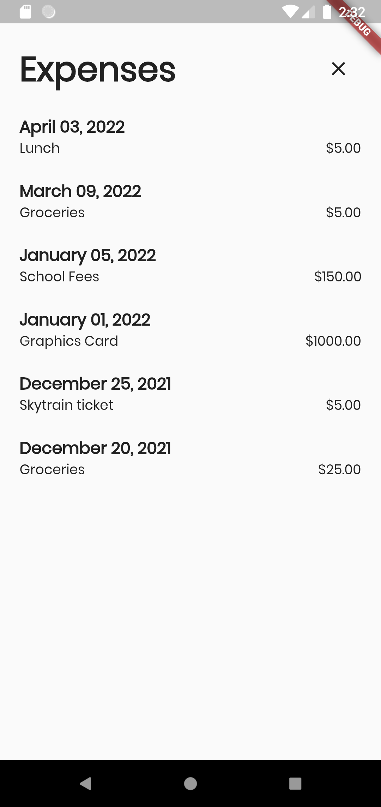

# Wallet Hero

Cross platform iOS/Android Flutter app which helps users keep track of their fiances.

Allows users to input expense data which saves to their phone's shared preferences. This expense data can be later filtered by date to analyze purchasing habits.

    
    
    
    

